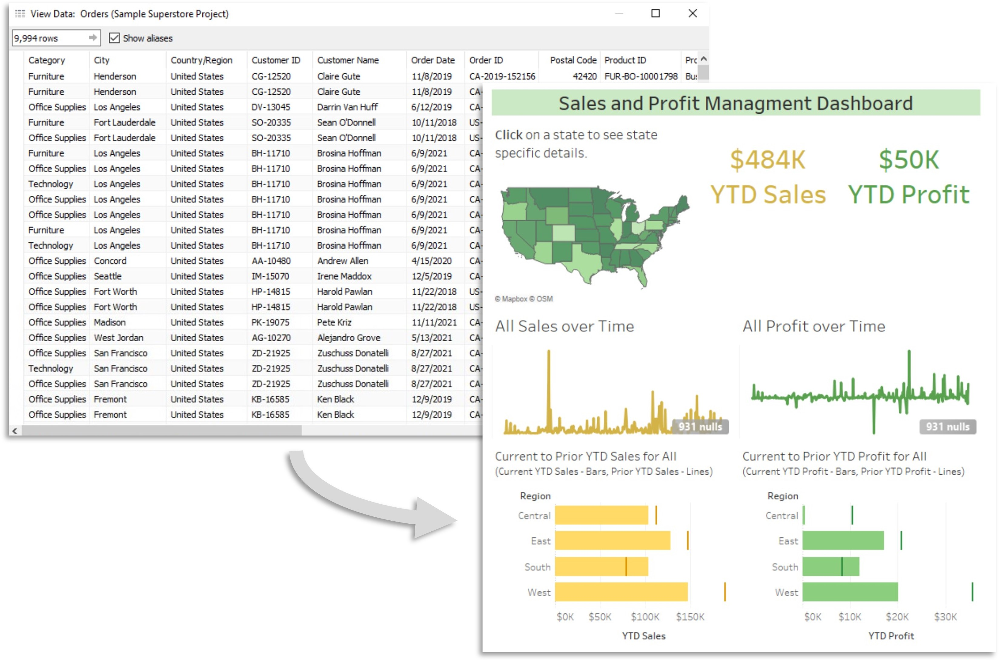
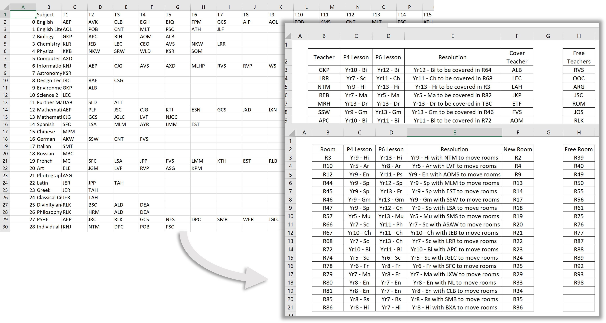
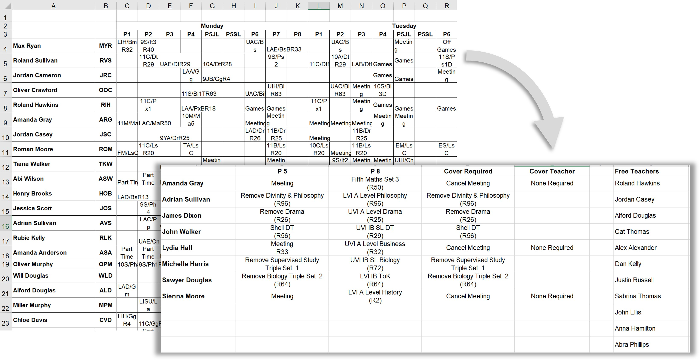
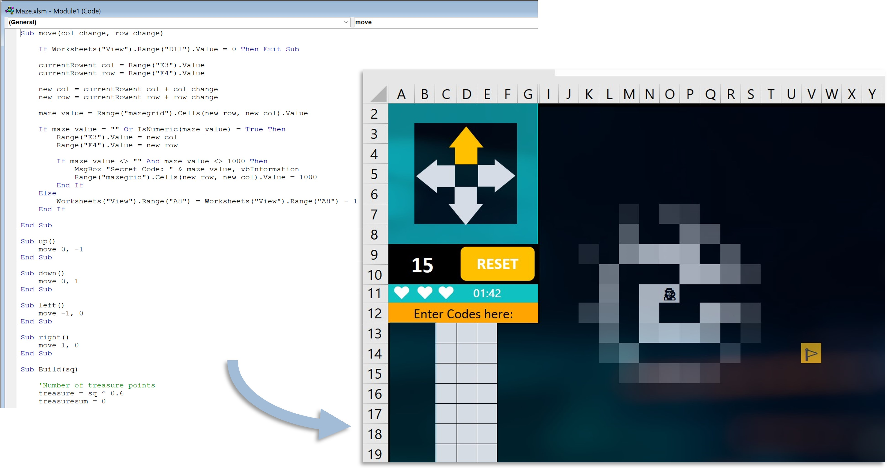

# Data Analysis
Sarah McCoy

## [Project 1: KPI Dashboard (Sales and Profits)](https://public.tableau.com/views/SalesandProfitManagementDashboard_16353345974800/SalesProfitDashboard?:language=en-US&:display_count=n&:origin=viz_share_link)
- This project involed taking data from excel, loading it into Tableau and then creating a dashboard highlighting sales and profits across stores, by state, in the US.
- This project was completed as part of a course authorized by Coursera Project Network.

## [Project 2: Automation of Timetable Reconfigurations](https://github.com/slmccoy/timetable.git)
- This project involved the **automation** of a standard timetable change within school using **Python**
- CSV files were imported from the main data managment system and then data was prepped for processing.
- The required short term changes were then created.
- An output excel file was then created to present changes in a readable manor to be shared with the school.

## [Project 3: Timetable Regconfiguration (VBA)](https://github.com/slmccoy/vba_timetable.git)
In order to allow the process to be automated more widely by other memebers of staff, the process needed to be written into and run directly within a speadsheet. This spreadsheet and **VBA code** runs a very similar reconfiguration process as the previous python project.

## [(Fun) Project 4: VBA Maze Game](https://github.com/slmccoy/vba_maze.git)
- Project to create an exciting excel game as an opening lesson for an introduction to **VBA/Excel** course.
- Code to play both the game and regenerate the grid are written in VBA.
- Idea: As you travel through the maze and find flags you get codes, collect all of the codes within the time to win.

