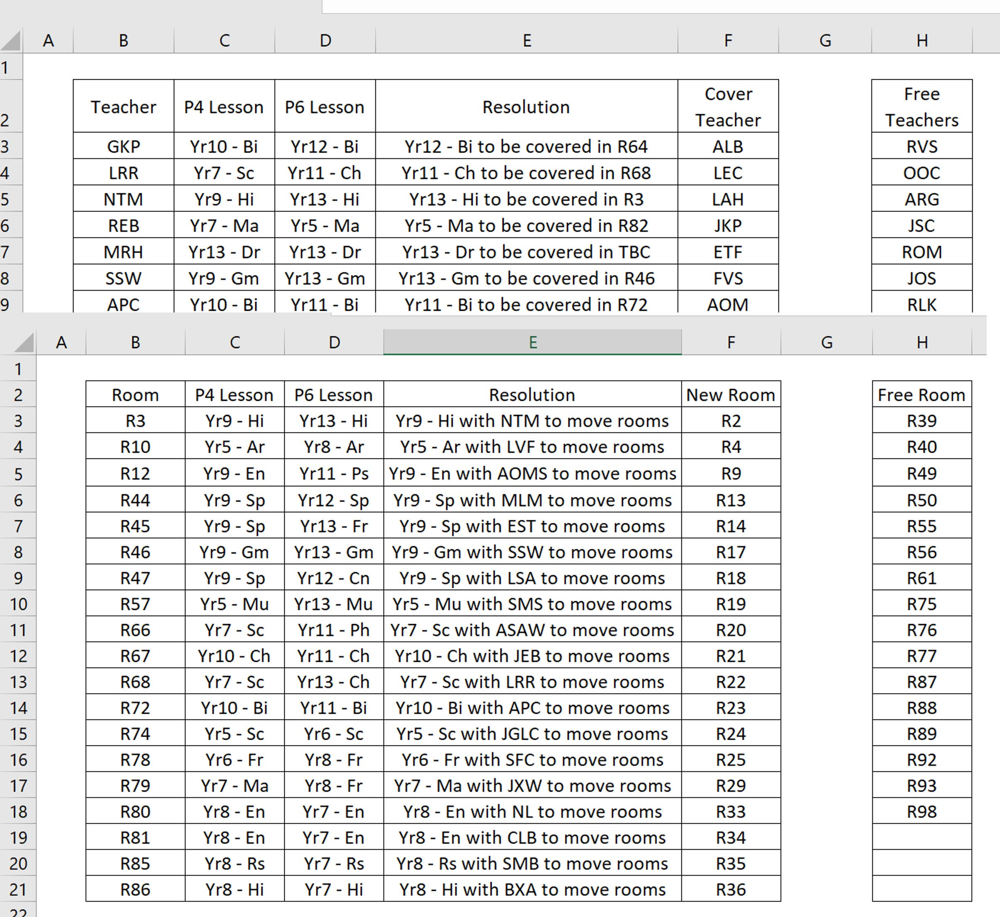

# Data Analysis
Sarah McCoy

## [Project 1: Automation of Timetable Reconfigurations](https://github.com/slmccoy/timetable.git)
- This project involved the **automation** of a standard timetable change within school using **Pyhton**
- CSV files were imported from the main data managment system and then data was prepped for processing.
- The required short term changes were then created.
- An output excel file was then created to present changes in a readable manor to be shared with the school.

